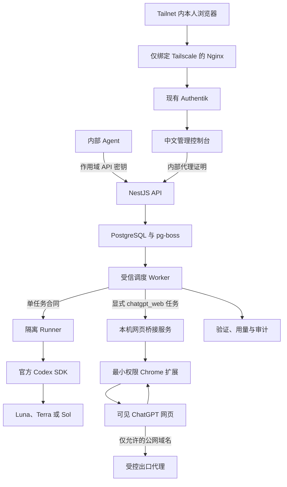
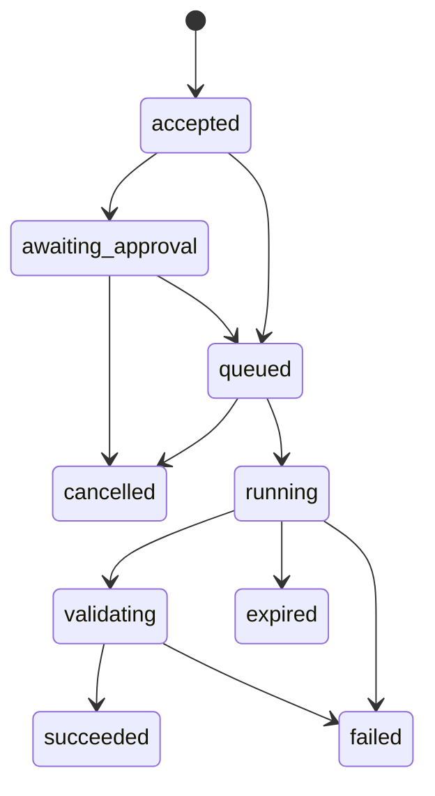

# 1 RouteLoom 架构

## 1.1 系统边界

图 1.1 系统主流程

所有入口先受 Tailnet 限制；根路径直接进入 Authentik，机器接口再使用独立 API 密钥

浏览器身份依次通过 Router 专用 Group、Nginx→Web 边缘证明和 Web→API 内部证明

API 与 Worker 没有 Codex 登录目录；只有隔离 Runner 挂载该目录，Runner 没有数据库、正文主密钥或容器套接字

ChatGPT Pro 网页实验通道默认关闭；调用方必须显式选择 `chatgpt_web`，浏览器通过独立桥接服务和受控出口代理运行，不能获得控制面秘密

## 1.2 单仓库

| 目录                   | 职责                                           |
| ---------------------- | ---------------------------------------------- |
| `apps/api`             | 身份、Responses、Jobs、治理与 OpenAPI          |
| `apps/worker`          | 受信队列消费、Runner 调度、验证与保留          |
| `apps/runner`          | 无数据库凭据的隔离 Codex 调用与额度读取        |
| `apps/web`             | 中文公开站点、本地 Passkey 和 Authentik 控制台 |
| `apps/mcp`             | 五个 Agent 委派工具                            |
| `apps/cli`             | 调用、批次、任务、取消、评测与额度命令         |
| `apps/chatgpt-bridge`  | 默认关闭的网页桥接服务、协议和 Chrome 扩展     |
| `packages/contracts`   | Zod 任务合同与公共类型                         |
| `packages/router`      | 版本化确定性路由状态机                         |
| `packages/providers`   | Codex SDK 与 App Server 额度适配               |
| `packages/persistence` | PostgreSQL、加密载荷、身份与审计               |
| `packages/security`    | HMAC、AES-256-GCM、扫描与脱敏                  |
| `packages/client`      | OpenAPI 生成类型与 TypeScript 客户端           |

## 1.3 状态与路由

接单时固定一个 Codex 模型和一个推理等级；首个输出后不切换模型；同模型只允许一次瞬时故障重试

网页实验任务在接单时固定 1 个页面可见模型和 1 个标签；发送后不自动重试，流式接口只返回状态和最终完整正文

任务创建、初始事件、审计与 pg-boss 消息共享一个 PostgreSQL 事务；Worker 以原子状态转换认领任务，重复队列消息不能产生第二个执行者；事件序号由任务行上的单调计数器分配

网页发送前会持久化提交意图，并把递增租约代次、一次性发送许可和 API 接单时生成的绝对截止时间传到 Bridge 与扩展；旧 Worker、旧连接、过期许可或第二次发送动作都会被拒绝

网页模型来自页面动态目录并由管理员逐项启用；网页没有可靠 Token、Credits、额度变化或 API 等效价格时，账本保存 `measurementStatus=unavailable`

`restricted` 禁止联网，`confirm` 经授权后开放写入和公网，`full` 直接开放本次一次性工作区和公网；三者都不能访问宿主机、身份目录、内部网络或其他任务工作区

会话默认是一次性的，执行结束即删除 Codex 会话文件；任务声明 `sessionMode: "persistent"` 后，Worker 在成功时把 Codex 线程登记到 `session_threads` 表（只存线程治理元数据，不存正文），后续任务用 `sessionKey` 续聊，路由通过 `session_sticky` 决策粘住首轮模型与推理档位；线程记录默认 24 小时到期（`SESSION_THREAD_TTL_MS`），Worker 的保留期清扫会删除到期记录；Runner 按 `CODEX_SESSION_TTL_MS` 定期清理到期的会话文件；除 Responses 子集外，`POST /v1/chat/completions` 提供 OpenAI Chat Completions 兼容映射，复用同一 Jobs 内核

## 1.4 设计记录

- [ADR 0001：确定性粘性路由](docs/adr/0001-deterministic-sticky-routing.md)
- [ADR 0002：PostgreSQL 持久队列](docs/adr/0002-postgres-persistent-queue.md)
- [威胁模型](docs/threat-model.md)
- [VPS 部署](docs/deployment.md)
- [ChatGPT Pro 网页实验通道](docs/chatgpt-web-experiment.md)
- [评测方法](docs/evaluation.md)
