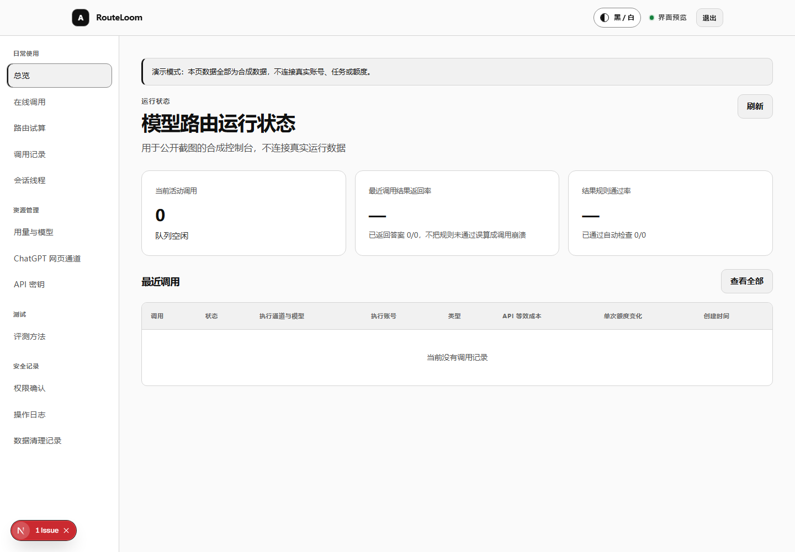

<div align="center">
<h1>RouteLoom</h1>
<p>A private, auditable, and recoverable gateway for personal Codex execution and controlled ChatGPT web sessions</p>
<p><code>0.1.0 prerelease</code> · <code>Apache-2.0</code> · <code>public source</code> · <code>private deployment</code></p>
<p><a href="README.md">中文</a> · <a href="docs/usage.md">Usage</a> · <a href="docs/api-capabilities.md">API capabilities</a> · <a href="docs/deployment.md">Deployment</a> · <a href="SECURITY.md">Security</a></p>
</div>

<div align="center">

<p><em>Figure 1.1 — RouteLoom console rendered with synthetic data; it contains no real accounts, jobs, addresses, or internal identifiers</em></p>
</div>

## 1 Project scope

RouteLoom is a self-hosted service for an account owner's personal devices and internal automation

It puts request handling, durable queuing, execution, validation, history, and permissions behind one control plane for Codex coding work and controlled ChatGPT web tasks

- The Codex channel uses the official Codex CLI, TypeScript SDK, and App Server, with ephemeral tasks and resumable threads
- The ChatGPT web channel uses visible isolated browsers, a least-privilege extension, and restricted egress; normal chat and search use a fresh Temporary Chat per task
- Deep Research uses a fresh persistent conversation per task, and callers must explicitly acknowledge ChatGPT history retention
- Durable jobs preserve status, events, results, and audit records so clients can recover after a disconnected request
- Scoped keys can allow Codex only, ChatGPT only, or both channels, while separately limiting Codex execution permissions

The source repository is public, while deployments, accounts, credentials, task content, and runtime data remain private to the operator

This is not an official OpenAI project, an OpenAI API service, a subscription resale service, or a shared-account service

The web channel depends on the live page and can pause for authentication, CAPTCHA, rate limits, or interface changes; it never resubmits when delivery is uncertain

## 2 First successful request

### 2.1 Prerequisites

- Node.js 22 or newer
- pnpm 10.33.4
- Docker 29 with Compose 2.40, or compatible versions
- A Codex login directory dedicated to this service

### 2.2 Start the local control plane

1. Install the locked workspace dependencies from the repository root

```powershell
# Install every workspace dependency from the current lockfile
pnpm install --frozen-lockfile
```

2. Generate local secrets and start the Codex profile

```powershell
# Prepare the local environment, then start the database, API, web app, worker, and isolated runner
pwsh ./deploy/scripts/prepare-local.ps1
docker compose --env-file ./deploy/local.env -f ./deploy/compose.yaml --profile codex up --build -d
```

3. Open `http://localhost:13211/setup`, register the first passkey, and save the one-time recovery codes offline

4. Open `http://localhost:13211/console/playground`, submit a minimal job, and inspect its result in job history

A successful job moves through accepted, queued, running, and validating states before showing either a result or a specific failure

See the [deployment guide](docs/deployment.md) for production networking, authentication, backup, and rollback requirements

## 3 APIs and permissions

An idempotency key is a unique value supplied with one write request to prevent a network retry from creating another job. The server binds it to the request body: the same key and body return the original job, while the same key with different content returns a conflict. Use it for job creation and other repeatable writes. It does not replace the job ID and cannot make an already submitted external task safe to resend

<div align="center">
<p><strong>Table 3.1 — Public entry points and observable results</strong></p>
<table>
<thead><tr><th>Entry point</th><th>Use</th><th>Result</th></tr></thead>
<tbody>
<tr><td><code>POST /v1/responses</code></td><td>Text, structured output, and unified model calls</td><td>Synchronous result or server-sent events</td></tr>
<tr><td><code>POST /v1/chat/completions</code></td><td>Compatibility for existing chat clients</td><td>Chat result or server-sent events</td></tr>
<tr><td><code>POST /api/v1/jobs</code></td><td>Long-running, batched, and asynchronous work</td><td>Job ID, status, events, and result</td></tr>
<tr><td><code>GET /api/v1/quota</code></td><td>Inspect the Codex quota snapshot</td><td>Source, timestamp, and available levels</td></tr>
<tr><td><code>GET /api/v1/chatgpt-web/status</code></td><td>Inspect the web account pool</td><td>Redacted health, lease, and cooldown state</td></tr>
</tbody>
</table>
</div>

The API accepts only parameters explicitly implemented by the current repository

Unsupported OpenAI parameters return `400 unsupported_parameter` instead of being silently ignored

Streaming calls use server-sent events for status and the final complete output; they do not fabricate token-by-token streaming

See [API capabilities](docs/api-capabilities.md) for parameters, events, errors, and compatibility boundaries, and [usage](docs/usage.md) for copyable examples

### 3.1 Minimal Responses request

```powershell
# Submit a minimal text task with a scoped key that was shown once
$Headers = @{
  Authorization = "Bearer $env:ROUTELOOM_API_KEY"
  "Idempotency-Key" = [guid]::NewGuid().ToString()
}
$Body = @{
  model = "luna"
  input = "Reply with OK only"
  reasoning = @{ effort = "low" }
} | ConvertTo-Json -Depth 6
Invoke-RestMethod -Method Post -Uri "https://router.example.com/v1/responses" -Headers $Headers -ContentType "application/json" -Body $Body
```

Replace the example address with your protected deployment and set the key in the current process

Reuse the original idempotency key when retrying the same request after a network failure, and generate a new value for a new task

### 3.2 Permission choices

<div align="center">
<p><strong>Table 3.2 — Key channels and Codex execution permissions</strong></p>
<table>
<thead><tr><th>Selection</th><th>Allowed</th><th>Not allowed</th></tr></thead>
<tbody>
<tr><td>Codex only</td><td>Codex models and durable jobs</td><td>ChatGPT web tasks</td></tr>
<tr><td>ChatGPT only</td><td>Enabled web chat, search, or Deep Research</td><td>Codex execution</td></tr>
<tr><td>Codex + ChatGPT</td><td>Both channels</td><td>Operations beyond the key lifetime, rate, or execution scope</td></tr>
</tbody>
</table>
</div>

Codex `restricted`, `confirm`, and `full` presets are a separate execution boundary and cannot widen a channel denied by the key

## 4 Runtime design

Requests pass browser authentication or scoped-key verification before entering the PostgreSQL durable queue

The job row, initial events, audit records, and pg-boss message commit in one PostgreSQL transaction, so any failed write rolls the entire operation back

The trusted worker schedules only: Codex jobs go to an isolated runner, while web jobs go to the selected account's independent browser

An atomic worker claim gives duplicate queue delivery at most one executor, while PostgreSQL allocates event sequences atomically instead of using a concurrent maximum-value query

If an older Codex invocation is still exiting after a Worker restart, later jobs wait within their original deadline for the Runner to become free. A client disconnect or task deadline cancels the corresponding Runner invocation, preventing a stale slot without counting the wait as another upstream submission

Structure, ownership, and acceptance checks run before results are written to job history, events, and audit records

See [architecture](ARCHITECTURE.md) for component relationships, state transitions, and session behavior

## 5 ChatGPT web channel

- Normal chat and search always use a fresh Temporary Chat with zero prior messages, personalization disabled, and at most one submission
- Deep Research uses a fresh persistent conversation, does not reuse older conversations, and does not support web `sessionKey` continuation
- `chatgpt-web.auto` selects the page's automatic model and is not a reasoning depth; `thinking_depth` accepts only a live depth label returned by the model catalog, while omission follows the page default, so do not pass `auto`
- Every account has an independent browser profile, concurrency limit of `1`, pacing, lease, cooldown, and quarantine state
- Plans are operator metadata limited to `plus`, `pro`, or `unknown`; the service never guesses a plan from cookies, page text, or response time
- Failover is permitted only before submission is definitively attempted; once the page accepts a task or delivery is uncertain, the service does not switch accounts or resend
- Every web call persists a submission intent before Browser dispatch, then carries the account lease epoch and a one-use send permit; stale workers, stale connections, and a second send action are rejected
- The deadline starts when the API accepts the task and the same absolute timestamp crosses Worker, Runner, Bridge, and page execution without being reset by queueing or forwarding
- A healthy browser process does not mean that an account can accept work; the page must also be recognizable, authenticated, qualified, and free of a blocking lease or cooldown
- An isolated profile preserves local browser data but cannot prevent ChatGPT from expiring a server-side session; the pool removes that account and reports that sign-in is required

The web channel is disabled by default

An administrator must complete a no-message readiness check and one real single probe before an account can join the production pool

An account with a prior successful probe can recover after it returns to an authenticated, idle state with no pending task. A changed page protocol, verification screen, or expired login still requires a fresh check

See the [ChatGPT web channel guide](docs/chatgpt-web-experiment.en.md) for login, probes, data risk, and failure handling

## 6 Security boundaries

- Browser access is protected by Authentik, while machine calls use expiring, revocable, rate-limited scoped keys
- API keys retain only a fixed prefix and an authentication-code digest; plaintext is displayed once at creation
- Job bodies and events use per-record encryption, with 24-hour body retention and 90-day redacted metadata retention by default
- Runners receive no database credentials, content master key, container socket, or other job workspace
- Web browsers receive no Codex login, database access, host directory, or control-plane secret
- Browser profile volumes are credentials: they are excluded from ordinary backups and must not be copied between accounts
- Repository examples use `.example.com`, synthetic tasks, and placeholder keys only

Read the [threat model](docs/threat-model.md) and [security policy](SECURITY.md) before processing real data, allowing external writes, or enabling browser automation

## 7 Verification and support boundary

The repository's unified check runs formatting, static analysis, type checking, unit tests, and production builds in sequence

```powershell
# Run the complete automated check currently defined by the repository
pnpm check
```

After an API contract change, also run `pnpm generate:openapi` and confirm that generation leaves no uncommitted difference

Container configuration, isolation, real Codex execution, and real web execution are deployment checks and cannot be replaced by local unit tests

Version `0.1.0` is a prerelease. Compatibility is limited to the repository contracts and tests, not unimplemented OpenAI parameters or unspecified web behavior

## 8 Documentation and collaboration

- [Usage](docs/usage.md) covers calls, jobs, sessions, errors, and commands
- [API capabilities](docs/api-capabilities.md) lists supported parameters, streaming behavior, and compatibility limits
- [Deployment](docs/deployment.md) covers production networking, authentication, backup, rollout, and rollback
- [Implementation status](docs/implementation-status.md) separates implemented, conditional, and unsupported behavior
- [Evaluation](docs/evaluation.md) explains routing and quality validation
- [Contributing](CONTRIBUTING.md) defines the development environment and pre-commit checks
- [Security](SECURITY.md) provides the private vulnerability-reporting path and disclosure boundary

## 9 License

Code is available under the [Apache License 2.0](LICENSE), with third-party records in [THIRD_PARTY_NOTICES](THIRD_PARTY_NOTICES)

OpenAI, ChatGPT, Codex, and related marks belong to their respective owners
