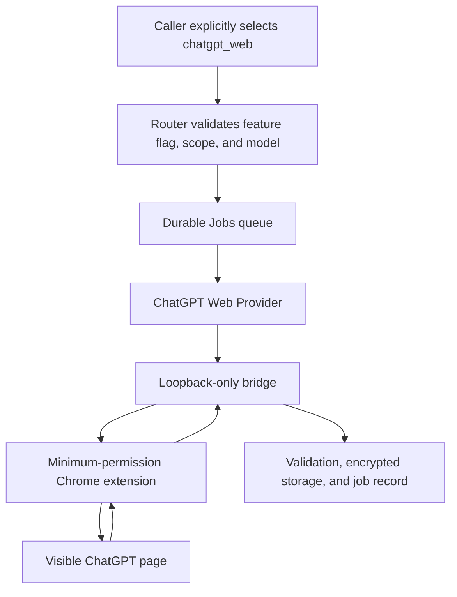

# ChatGPT Web Channel

## 1 Status and boundary

This channel sends an explicit Router job to a fixed pool of visible ChatGPT pages, where each container's minimum-permission Chrome extension enters the prompt and reads the final answer.

It is not an official API and is not guaranteed to remain available. UI structure, sign-in, the model menu, verification screens, and generation states can change without notice.

The repository defaults to `CHATGPT_WEB_ADAPTER_ENABLED=false`. The API rejects web jobs until an administrator completes the real-page probe and explicitly enables the adapter.

Personal or non-profit use does not automatically remove terms risk. OpenAI's Terms of Use prohibit automatic or programmatic extraction of data or output and circumvention of protective measures [1]. ChatGPT Pro remains subject to those terms [2].

The implementation does not read cookies, copy browser tokens, call a private `backend-api`, intercept site Server-Sent Events, expose a remote Chrome DevTools Protocol port, automate verification, or disguise browser fingerprints.

## 2 Architecture



Figure 2.1. Execution path for an explicit ChatGPT web job.

Each account browser prewarms one work tab. Chat and search enter a new non-personalized Temporary Chat. Deep Research enters a new ordinary persistent conversation only after the caller explicitly acknowledges retention. Both paths prove that user turns, assistant turns, composer content, and generation state are empty before submission.

The extension only locates the editor, controls, turns, and generation state. A native X11 input agent inside the isolated container activates the tab, clicks the editor, clears it, pastes the prompt, and clears the temporary clipboard after a character-for-character DOM check. The extension requests no page clipboard permission.

Each account container has one page slot. The extension returns an answer only after the exact user echo appears, the assistant turn follows it, tab and document binding remain unchanged, terminal turn actions appear, generation ends, and two reads of the body remain stable.

There is no automatic retry after send. An uncertain send returns `chatgpt_delivery_uncertain` instead of risking a duplicate conversation or duplicate Pro usage.

A failed tab is quarantined for ten minutes for noVNC inspection. Only element counts, lengths, SHA-256 digests, stage, and error class are recorded. The tab then navigates to a fresh conversation and repeats the zero-message check.

## 3 Deployment

The visible browser runs as a dedicated non-root user with a read-only root filesystem and a temporary download directory. Its persistent profile volume is a credential, uses mode `0700`, and is excluded from ordinary backups.

The browser gets no database, payload key, Codex identity, container socket, host directory, or other service credential. A controlled proxy is its only egress path and denies loopback, private, Tailnet, Docker, and cloud-metadata destinations.

The browser uses dedicated seccomp and AppArmor policies derived from Docker's default boundary, adding only the namespace-related system calls Chromium needs. It remains non-root, capability-free, no-new-privileges, and read-only.

Chrome 116 and later can keep an extension service-worker WebSocket alive through regular activity [3]. The extension uses that documented mechanism with a short keepalive interval.

Start the components without opening admission:

```bash
# Build the experiment while keeping CHATGPT_WEB_ADAPTER_ENABLED=false.
ACTION=start \
PRODUCTION_ENV=/var/lib/routeloom/production.env \
RELEASE_DIR=/srv/example/routeloom/releases/<commit> \
bash deploy/scripts/enable-chatgpt-web.sh
```

From the Tailnet, open `https://router.example.com/chatgpt-browser/` and `https://router.example.com/chatgpt-browser-b/`, pass Authentik, and sign in each account manually through its noVNC page. Handle verification and account warnings only in those visible pages.

Verify the outer and Chromium sandbox, then inspect `chrome://sandbox` in the protected visible browser:

```bash
BROWSER_CONTAINER=routeloom-chatgpt-browser-1 \
bash deploy/scripts/verify-chatgpt-browser-sandbox.sh
```

## 4 Real-page probe

Real ChatGPT page tests never run in GitHub Actions. Each account entering the production pool first runs a no-message `readiness` check, then one `single_probe` that submits one ordinary chat.

`ACTION=start` prepares the browser-side Bridge for production requests while API and Worker admission remains closed. `ACTION=enable` then reloads only API and Worker, not Chromium, so opening admission does not invalidate the account session that just passed its probe. The Bridge remains reachable only on the internal control network, and diagnostic calls still require the dedicated token.

Diagnostic startup reuses the immutable images already pinned by the production release and never runs an ad-hoc Docker build. New images are built and verified only as part of a release.

The account must report `succeeded`, `submittedCount=1`, `temporaryChatVerified=true`, `ownershipMatched=true`, a result length and SHA-256 digest, and a final idle page. Any duplicate send, result misattribution, rate limit, verification screen, or sign-in failure rejects qualification. One successful account can enter production at per-account concurrency one. `full_10` is optional strengthening evidence, not an enablement prerequisite.

Only after the gate passes:

```bash
# Open Router admission for the experimental channel after the real probe passes.
ACTION=enable \
PRODUCTION_ENV=/var/lib/routeloom/production.env \
RELEASE_DIR=/srv/example/routeloom/releases/<commit> \
bash deploy/scripts/enable-chatgpt-web.sh
```

### 4.1 Current VPS qualification result

The point-in-time validation on 2026-09-09 showed that independent browser accounts A and B had both passed readiness and a real single probe. A was the primary account, B was secondary capacity when available, and per-account concurrency was one.

That dated result is historical evidence, not proof that either account is currently signed in or dispatchable. Use `GET /api/v1/chatgpt-web/status` and the account-pool console for live state.

The current release has completed a real Search call with verifiable sources and a real streaming Chat call. Those successes do not establish reliability for larger inputs or future page changes; inspect current jobs and account state before relying on the channel.

The web channel currently limits the complete task text serialized for the page to 4,000 characters, including the objective, context, constraints, expected output, and validation rules. Longer native pastes have made Chromium unresponsive or become ChatGPT pasted-text attachments, which the bridge cannot verify as an exact user message. An oversized request returns HTTP 422 with `chatgpt_web_input_too_long`, `maxCharacters`, and `actualCharacters` before creating a job or touching the browser. This limit does not apply to Codex tasks.

Sign-out, verification, account warnings, UI drift, and rate limits automatically remove the affected account. An uncertain post-submission task never moves to another account and is never resent. A recovered account must pass a fresh readiness check and single probe.

The console reports four separate layers. Process health means that the container, browser, extension, and sandbox are running. Authentication means that ChatGPT still accepts the stored browser session. Qualification means that the account passed a real probe under the current web policy. Dispatch eligibility additionally requires an idle account with no blocking lease, pacing interval, or cooldown.

The profile volume preserves local browser data but cannot prevent server-side session expiry. An expired account leaves dispatch immediately and reports `chatgpt_login_required` while the browser process remains healthy.

After a caller disconnect or task deadline, the Bridge cancels page activity, clears the old task identity, and waits for a fresh idle page. An account with a previous successful probe recovers only after the Bridge reports no pending request, no active job, an idle unsubmitted slot, valid authentication, and no current failure.

The 2026-08-31 convergence contract keeps chat and search at `conversationMode="temporary_per_request"`, `temporaryChat=true`, and `personalized=false`. Following explicit operator approval on 2026-09-09, Deep Research uses `persistent_per_request`, creates a fresh ordinary conversation, and requires an explicit retention acknowledgement. Every web mode still rejects `sessionKey` continuation.

Diagnostic mode uses a separate feature flag and a loopback token while production admission stays disabled. A single explicit probe records only stages, counts, text lengths, visibility, digests, and timing to distinguish blank page generation, rendering failure, selector drift, and incomplete output.

### 4.2 Zero-call page probe

The read-only probe requests only bridge health, diagnostics, and model catalog endpoints. It never calls `/invoke`, enters text, or creates a ChatGPT conversation.

```bash
# Address the bridge only from a trusted operations environment.
export CHATGPT_BRIDGE_URL=http://chatgpt-browser:13216
# Read the bridge secret from a root-only file without printing it.
export CHATGPT_BRIDGE_API_TOKEN_FILE=/run/secrets/chatgpt_bridge_api_token
# Verify that the experimental channel remains disabled.
export EXPECTED_ADAPTER_ENABLED=false
# Check sign-in, page controls, idle state, and redacted page structure.
node deploy/scripts/probe-chatgpt-web-readiness.mjs
```

A passing probe proves only that the current sign-in is valid, page controls are recognizable, and no web task is running. It does not prove stable chat, search, or deep-research output.

### 4.3 Console qualification entry

The protected “ChatGPT web channel” page can run the suites below for a selected account slot:

- `readiness`: read-only, with no message sent;
- `single_probe`: one ordinary chat, and the minimum gate for enabling the web channel;
- `chat_3`: three consecutive chat jobs;
- `deep_2`: two consecutive deep-research jobs;
- `full_10`: four chats, four searches, and two deep-research jobs.

Create a run with `POST /api/v1/chatgpt-web/qualification-runs`, an `Idempotency-Key`, and optionally `accountId` such as `account-a`. Read it from `GET /api/v1/chatgpt-web/qualification-runs/{id}`. Administrators can view the fixed pool's redacted state, routing weights, and sanitized quota windows through `GET /api/v1/chatgpt-web/accounts`; edit account metadata with `PATCH /api/v1/chatgpt-web/accounts/{accountId}`; and atomically replace all weights with `PUT /api/v1/chatgpt-web/routing-weights`. The integer weights must include every configured slot and total exactly 100.

New pools divide traffic evenly. Weights apply only among healthy, authenticated, qualified, idle accounts outside pacing and cooldown. A healthy zero-weight account receives no routine traffic but remains a pre-submission fallback when no positive-weight account is eligible. A submitted request is never moved or resent. Quota collection runs inside each isolated browser and exports only percentages, window duration, reset time, freshness, and a safe error code. This Codex subscription snapshot is display-only and never participates in `chatgpt_web` eligibility or routing, so a zero Codex balance does not block ordinary web chat. Cookies, access tokens, email addresses, upstream account IDs, and raw responses remain inside the browser.

Qualification records exclude prompts, answers, account identity, and conversation URLs. They contain only a redacted slot id plus conversation mode, item state, duration, output length, output SHA-256, source count, submission count, ownership result, fresh temporary-or-persistent conversation verification, and error code. Pool state likewise contains only opaque slots, manual plan labels, and redacted diagnostics.

## 5 Calling the channel

### 5.1 Responses

```powershell
$RouterUrl = "https://router.example.com" # Use the protected Router address.
$Headers = @{ # Web jobs require jobs:write and chatgpt:web scopes.
    Authorization = "Bearer $env:ROUTELOOM_API_KEY" # Read the key from the current process only.
    "Idempotency-Key" = [guid]::NewGuid().ToString() # Reuse this value for retries of the same business request.
} # Finish the request headers.
$Body = @{ # Explicitly select the web experiment.
    model = "chatgpt-web.auto" # Use an administrator-enabled web model entry.
    input = "Research a synthetic topic and list public sources" # Keep credentials and personal data out of the prompt.
    aialra = @{ # These are namespaced Router extensions.
        execution_channel = "chatgpt_web" # Codex requests never switch here implicitly.
        chatgpt_mode = "search" # Select page search mode.
        conversation_mode = "temporary_per_request" # Create a new Temporary Chat for this job.
        temporary_chat = $true # Chat and search require a non-personalized Temporary Chat.
        require_sources = $true # Ask the bridge to extract public sources.
    } # Finish the experiment options.
} | ConvertTo-Json -Depth 8 # Preserve all nested fields.
Invoke-RestMethod -Method Post -Uri "$RouterUrl/v1/responses" -Headers $Headers -ContentType "application/json" -Body $Body # Wait for the final complete text.
```

Streaming requests emit state and one complete final body; they do not fabricate token deltas. Prefer Jobs for deep research rather than holding an HTTP request for up to one hour.

### 5.2 Jobs

```json
{
  "task": {
    "executionChannel": "chatgpt_web",
    "model": "chatgpt-web.auto",
    "objective": "Research a synthetic topic and list public sources",
    "chatgptWeb": {
      "mode": "search",
      "conversationMode": "temporary_per_request",
      "temporaryChat": true,
      "personalized": false,
      "requireSources": true
    },
    "deadlineMs": 600000
  }
}
```

JSON cannot legally contain comments. See [`openapi/openapi.yaml`](../openapi/openapi.yaml) for field constraints.

Chat and search use a new non-personalized Temporary Chat. Deep Research uses a new ordinary persistent conversation and requires `persistenceAcknowledged=true`; responses identify `persistent_chat_history`. No web mode continues an old conversation or retries automatically after timeout, rate limit, sign-in failure, verification prompt, UI change, or uncertain delivery.

After Deep Research mode selection, the extension waits for the editor node and geometry to stabilize before input. It may repeat the pre-submit input operation once only when the page is still the same fresh document, the user-turn count has not changed, generation is inactive, and the editor is provably empty. This is not a second submission: the submit control is still activated at most once, and any uncertain send state fails immediately.

After opening the tools menu for Search or Deep Research, the extension waits for the real menu row and its geometry to stabilize while excluding every Search control that already existed in the sidebar, navigation, or conversation. It recognizes the current `Search`, `Web search`, `网页搜索`, and `联网搜索` labels. Mode-menu interaction occurs before input and does not increase the message submission count.

If mode selection fails, private Bridge diagnostics identify whether the failure occurred before the tools menu opened, while locating or activating the menu item, or while confirming activation. They retain only control types, counts, and short labels, never the task prompt, answer, cookies, account identity, or conversation URL. `submittedCount=0` proves that no message was sent and permits a new task after a fixed release is deployed. A submitted or uncertain task must never be retried or moved to another account.

The first model-catalog request after a Browser restart waits for one current thinking-depth discovery instead of treating a not-yet-loaded empty catalog as proof that the account lacks Pro depths. An explicit `thinkingDepth` must still match the live `webThinkingDepths` value exactly, and the system never silently downgrades it.

### 5.3 CLI and MCP

```powershell
node apps/cli/dist/main.js research --task "Research a synthetic topic" --mode search --model chatgpt-web.auto # Create a web-search job and print its id.
node apps/cli/dist/main.js research --task "Research a synthetic topic" --mode deep_research --accept-persistent-chat # Explicitly accept persistent history for Deep Research.
node apps/cli/dist/main.js jobs --limit 20 # Inspect recent jobs and terminal states.
```

The MCP tool `delegate_chatgpt` accepts `objective`, `mode`, `model`, `require_sources`, `thinking_depth`, `accept_persistent_chat`, and `deadline_ms`. Deep Research requires `accept_persistent_chat=true`.

## 6 Models, usage, and errors

The web channel retains the `chatgpt-web.auto` entry. Its `webThinkingDepths` in `GET /api/v1/models` lists all enabled choices discovered from the current thinking menu of authenticated, qualified accounts. Labels remain native to the page, not mapped to Codex reasoning levels.

Use `task.chatgptWeb.thinkingDepth` for jobs, or `aialra.thinking_depth` for Chat Completions and Responses, with an exact discovered label. Omission preserves the page default; the model name's `auto` value is not a thinking depth. Discovery only opens and closes the menu on an idle page, without typing or sending messages. Results refresh on demand with a one-minute cache; an unreadable menu produces an empty list, never invented choices.

The web channel rejects Codex `reasoning_effort` and Responses `reasoning.effort` with HTTP 400 `unsupported_parameter` before creating a job. Use `aialra.thinking_depth` instead. `GET /api/v1/jobs/{id}` includes `webExecution` with the requested depth, page-verified depth, verification flag, and assigned account slot. A missing page observation stays null rather than being guessed. The retained `route.effort` field is not the effective web thinking depth.

The pool combines available choices but dispatches only to an account that actually offers the requested depth. Each fresh page selects and verifies the depth before submission. Missing choices return `chatgpt_thinking_depth_unavailable`, even when the remaining accounts are signed out, instead of being masked as a pool circuit error. Unconfirmed selections return `chatgpt_thinking_depth_unverified`. Neither failure sends a message or silently downgrades the requested depth.

Both menus and accessible sliders are supported. Slider discovery reads each actual label and restores the original choice; counts and labels are not hardcoded. CLI `call` / `research` accepts `--thinking-depth`; MCP `delegate_chatgpt` accepts `thinking_depth`.

The page supplies no reliable token, Codex Credit, quota-delta, or API-equivalent-price measurement. Results use `measurementStatus: "unavailable"`; the console displays that the page did not provide reliable data and never substitutes zero.

| Error                             | Direct cause                                     | Next action                                                                                                                          |
| --------------------------------- | ------------------------------------------------ | ------------------------------------------------------------------------------------------------------------------------------------ |
| `chatgpt_login_required`          | The dedicated browser is signed out              | Open noVNC and sign in manually                                                                                                      |
| `chatgpt_verification_required`   | Verification is visible                          | Complete it manually; the system does not bypass it                                                                                  |
| `chatgpt_ui_changed`              | Required UI elements are unrecognized            | Close admission and update the synthetic DOM contract                                                                                |
| `chatgpt_rate_limited`            | The page shows a usage or rate limit             | Wait for the page's stated recovery time                                                                                             |
| `chatgpt_delivery_uncertain`      | The bridge cannot prove whether send occurred    | Keep the job failed and do not auto-resend                                                                                           |
| `chatgpt_output_incomplete`       | The final text never became provably stable      | Inspect the visible page and extension state                                                                                         |
| `chatgpt_sources_missing`         | The answer completed without a verifiable source | Keep the task failed; the account remains available                                                                                  |
| `chatgpt_page_generation_blank`   | The page created an assistant turn without text  | Keep admission closed and inspect page mode and generation state                                                                     |
| `chatgpt_page_rendering_failed`   | DOM text exists but is not visible               | Repair rendering detection and rerun the stable-chat gate                                                                            |
| `chatgpt_output_selector_changed` | Visible output exists outside the known selector | Update result targeting and rerun the complete gate                                                                                  |
| `chatgpt_clarification_required`  | Deep research asks for more information          | Amend the contract and create a new job                                                                                              |
| `chatgpt_lease_lost`              | The account job lease disappeared unexpectedly   | Keep the job failed and do not resend; close admission and inspect Worker, database, and account-state updates for a lease overwrite |
| `chatgpt_timeout`                 | The job exceeded its own deadline                | Inspect the page before deciding on a new job                                                                                        |

Ordinary HTTP responses use `429` for `chatgpt_rate_limited`, with matching seconds in the body `retryAfter` and the `Retry-After` header. Pool cooldown hints use the earliest account recovery time while respecting any active global cooldown. Once an SSE response has started, its HTTP status cannot change to `429`: the terminal error event instead includes `chatgpt_rate_limited` and `retryAfter`, then the stream ends without reporting success or automatically resubmitting the task.

## 7 Concurrency and automatic shutdown

Only accounts with a successful `single_probe` enter web admission. Each account has concurrency one; one Worker schedules the pool by least load and earliest availability. Each account has its own 90-second pacing and cooldown. A disconnect, timeout, or uncertain ownership after submission never fails over or resends; `full_10` remains optional strengthening evidence.

After leasing an account, the Worker persists a submission intent without the prompt or answer and binds it to a monotonically increasing lease epoch. Bridge acceptance, the start of the native send action, and user-echo verification advance that record with monotonic phase numbers. The native send permit can be consumed once only. A stale Worker, stale WebSocket, expired permit, repeated phase, or second send action is rejected. The terminal result is recorded first, and the account becomes eligible again only after Browser reports an idle page with no pending task.

Web rate limits use progressive 30-, 60-, and 120-minute cooldowns. Expiry admits only one recovery probe. A successful probe enters observation, and three consecutive successes are required to clear that state; another rate limit returns to the next cooldown. Sign-out, verification, UI drift, duplicate sends, or result misattribution closes the channel and requires requalification. The official Codex SDK channel remains independent.

Administrators can read the secret-free state from `GET /api/v1/chatgpt-web/status`, including sandbox, sign-in, concurrency, queue, circuit, and qualification fields.

`chatgpt_lease_lost` does not mean that the account signed out or that ChatGPT applied a rate limit. It means the Router can no longer prove that the current Worker exclusively owns the account, so the job is aborted and the account is quarantined before another job can enter the same browser. The caller must not resend the original job with a new idempotency key. The administrator should close web admission, confirm that no web job is active, then inspect `activeJobId`, `leaseExpiresAt`, Worker restarts, and database errors before validating the repair with a new test job.

Disable admission but keep the visible browser for diagnosis:

```bash
# Close web-job admission without deleting the browser profile or job history.
ACTION=disable \
PRODUCTION_ENV=/var/lib/routeloom/production.env \
RELEASE_DIR=/srv/example/routeloom/releases/<commit> \
bash deploy/scripts/enable-chatgpt-web.sh
```

The `enable`, `disable`, and rollback paths recreate only API and Worker with an explicit `--no-deps`. Compose therefore cannot restart Browser, Egress Proxy, Runner, or PostgreSQL as a side effect, so switching admission does not interrupt a signed-in browser or invalidate the qualification that just passed.

Stop all experimental components:

```bash
# Stop the bridge, visible browser, and egress proxy without deleting the profile volume.
ACTION=stop \
PRODUCTION_ENV=/var/lib/routeloom/production.env \
RELEASE_DIR=/srv/example/routeloom/releases/<commit> \
bash deploy/scripts/enable-chatgpt-web.sh
```

## 8 References

[1] OpenAI, “Terms of Use.” <https://openai.com/policies/terms-of-use/>

[2] OpenAI, “About ChatGPT Pro.” <https://help.openai.com/en/articles/9793128/>

[3] Chrome for Developers, “Use WebSockets in service workers.” <https://developer.chrome.com/docs/extensions/how-to/web-platform/websockets>

[4] AIALRA-0, “TrilliumFlow.” <https://github.com/AIALRA-0/TrilliumFlow>

[5] miuuyy, “codex-chatgpt-web.” <https://github.com/miuuyy/codex-chatgpt-web>

[6] Octo-Lex, “ChatGPT-Web2API.” <https://github.com/Octo-Lex/ChatGPT-Web2API>

[7] DrA1ex, “chatgpt-bridge.” <https://github.com/DrA1ex/chatgpt-bridge>
