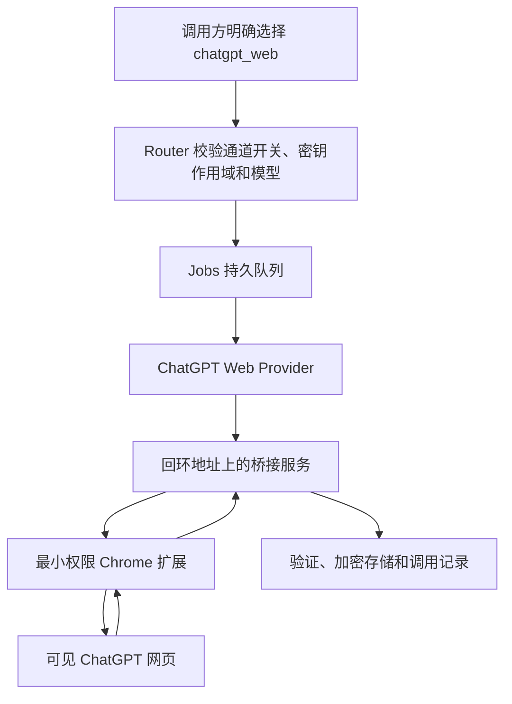

# ChatGPT 网页通道

## 1 通道状态

该通道把 Router 任务交给固定账号池中的可见 ChatGPT 网页浏览器，再由每个容器内的最小权限 Chrome 扩展输入任务并读取最终回答

它不是官方 API，也不保证长期可用；ChatGPT 的页面结构、登录流程、模型菜单、验证页面和生成状态变化都可能使调用中断

仓库默认设置 `CHATGPT_WEB_ADAPTER_ENABLED=false`；完成本页的真实网页探针并由管理员明确启用前，API 会拒绝网页任务

个人或非盈利使用不会自动消除服务条款风险；OpenAI 使用条款禁止自动或程序化提取数据或输出，也禁止规避保护措施 [1]；ChatGPT Pro 说明同时要求遵守使用条款 [2]

实现遵守以下固定边界：

- 登录：管理员只在受 Tailnet 和 Authentik 保护的可见 noVNC 页面中手动登录
- 页面控制：扩展只使用可访问名称、语义化 DOM 与 `MutationObserver`
- 凭据：代码不读取 Cookie，不复制网页登录令牌，不调用私有 `backend-api`
- 传输：代码不拦截站点 Server-Sent Events，不开放 Chrome DevTools Protocol 远程调试端口
- 验证：出现验证码、重新登录或账号警告时立即暂停并通知管理员
- 反自动化：不增加指纹伪装、验证码绕过或保护规避代码

## 2 执行流程



图 2.1 ChatGPT 网页任务从接单到结果保存的流程

浏览器池中的每个账号容器只预热 1 个工作标签。普通聊天和搜索先进入新的非个性化 Temporary Chat；Deep Research 在调用方明确确认留存风险后进入新的普通持久会话。两类任务都必须确认用户消息、助手消息、编辑器内容和生成状态全部为空

扩展只负责定位编辑器、按钮、回合和生成状态；实际输入由隔离容器中的 X11 原生键鼠代理完成：激活标签、点击编辑器、清空、粘贴、逐字核对后立即清空临时剪贴板，扩展不申请网页剪贴板权限

扩展只有在本任务的用户消息精确回显、助手回合位于其后、标签与文档绑定不变、终态操作栏出现、生成结束且正文连续两次稳定时才返回结果

任务发送后不会自动重试；无法确认是否已经发送时返回 `chatgpt_delivery_uncertain`，防止重复创建对话或重复消耗 Pro 用量

失败标签冻结 10 分钟，供管理员从 noVNC 查看现场；系统只记录元素数量、长度、SHA-256 摘要、阶段和错误分类，随后自动进入新对话并重新检查零消息状态

## 3 安全部署

### 3.1 组件边界

- 浏览器账户：专用非 root 用户运行 Chromium，根文件系统只读，下载目录使用临时文件系统
- 浏览器配置：持久配置卷保存登录状态，权限设为 `0700`，按登录凭据处理，不进入普通备份
- 桥接认证：每次浏览器启动生成新的扩展密钥；Worker 使用独立桥接密钥，两个密钥都不得写入任务正文
- 网络：浏览器只能通过受控出口代理访问允许的 ChatGPT、OpenAI、静态资源、登录和 Cloudflare 验证域名
- 内网阻断：出口代理拒绝回环、私网、Tailnet、Docker 网络和云主机元数据地址
- 秘密隔离：浏览器容器不获得数据库、正文主密钥、Codex 登录目录、容器套接字、宿主目录或其他服务凭据
- 沙箱：浏览器使用基于 Docker 默认策略的专用 seccomp 和 AppArmor 配置，只额外允许 Chromium 用户命名空间所需系统调用；仍保留非 root、全部 Capability 删除、`no-new-privileges` 和只读根文件系统

Chrome 扩展 Service Worker 使用 WebSocket 与桥接服务通信；官方说明 Chrome 116 起可以通过固定间隔活动维持此连接 [3]

### 3.2 启动但不开放调用

第一步，生成实验通道所需的随机密钥并保持功能开关关闭

```bash
# 生成本地部署文件和随机密钥，不会启用网页任务接单
bash deploy/scripts/prepare-production.sh
```

第二步，只启动可见浏览器、桥接服务和受控出口代理

```bash
# 构建实验组件并保持 CHATGPT_WEB_ADAPTER_ENABLED=false
ACTION=start \
PRODUCTION_ENV=/var/lib/routeloom/production.env \
RELEASE_DIR=/srv/example/routeloom/releases/<commit> \
bash deploy/scripts/enable-chatgpt-web.sh
```

第三步，从 Tailnet 内访问 `https://router.example.com/chatgpt-browser/` 和 `https://router.example.com/chatgpt-browser-b/`，通过 Authentik 后分别在 noVNC 页面手动登录两个账号

第四步，检查桥接健康和只读页面探针；探针必须识别登录状态、模型菜单、Temporary Chat、编辑器、发送按钮和结果区域

第五步，验证外层和 Chromium 沙箱；脚本检查用户命名空间、seccomp、AppArmor、进程参数和桥接健康，管理员还需要在受保护的可见浏览器中核对 `chrome://sandbox`

```bash
BROWSER_CONTAINER=routeloom-chatgpt-browser-1 \
bash deploy/scripts/verify-chatgpt-browser-sandbox.sh
```

## 4 真实网页探针

真实网页测试不会在 GitHub Actions 中运行。每个准备进入生产池的账号先执行一次不发送消息的 `readiness`，再执行一次只提交一条普通聊天的 `single_probe`

账号必须同时满足以下条件：

- `readiness` 确认浏览器、扩展、页面、登录、沙箱和空闲状态正常
- `single_probe` 状态为 `succeeded`
- `submittedCount=1`
- `temporaryChatVerified=true`
- `ownershipMatched=true`
- 助手结果具有长度和 SHA-256 摘要
- 页面恢复空闲，且没有重复发送、错误归属、限流、验证码或登录异常

一个账号通过后即可按单账号并发 `1` 加入生产池；`full_10` 只用于管理员主动选择的强化观察，不是启用前置条件

达到门槛后执行：

```bash
# 只有生产账号通过 readiness 和 single_probe 后才开放网页任务接单
ACTION=enable \
PRODUCTION_ENV=/var/lib/routeloom/production.env \
RELEASE_DIR=/srv/example/routeloom/releases/<commit> \
bash deploy/scripts/enable-chatgpt-web.sh
```

### 4.1 当前 VPS 验证结果

2026-09-09 的一次性验收曾证明 A、B 两个独立浏览器账号均完成就绪检查和单次真实探针，A 是主账号，B 在可用时作为次级负载账号，每账号并发固定为 `1`

这是一条带日期的历史证据，不代表账号当前仍然登录或可调度；实时状态必须以 `GET /api/v1/chatgpt-web/status` 和账号池页面为准

当前版本已完成真实 Search 调用并返回可验证来源，也已完成真实流式 Chat 调用。历史上的空白助手节点和超时记录只用于回归测试，不能代表当前运行状态

账号出现登录失效、验证码、账号警告、页面变化或限流时会被自动摘除；提交状态不确定的任务不会换号或重发。账号恢复后必须重新通过就绪检查和新的单次探针

账号状态分为四层，控制台分别显示，不能相互代替：

- 进程健康表示容器、浏览器、扩展和沙箱仍在运行
- 登录有效表示 ChatGPT 服务端当前仍接受浏览器会话
- 已验证表示该账号曾通过当前网页策略的真实单探针
- 可调度表示账号同时满足启用、登录、验证、空闲、发送间隔和冷却要求

浏览器配置卷保存本地登录资料，但服务端仍可让会话过期；发生这种情况时，容器继续保持健康，账号立即退出调度，并返回 `chatgpt_login_required`

任务超时或调用方断开后，Bridge 会取消当前页面动作、清除旧任务身份并等待页面回到新对话；只有页面报告零待处理任务、空闲槽位、有效登录和无当前错误时，曾经通过探针的账号才会恢复接单

2026-08-31 收尾版本把普通聊天和搜索固定为 `conversationMode="temporary_per_request"`、`temporaryChat=true` 和 `personalized=false`。2026-09-09 经运营者明确批准，Deep Research 改为 `persistent_per_request`，每次新建普通会话并要求显式留存确认；所有网页模式仍拒绝 `sessionKey` 续接

诊断模式使用独立开关和回环令牌，在生产 API 仍关闭时只允许 1 个显式探针；它只保存元素数量、文本长度、可见性、阶段和摘要，用于区分页面未生成正文、页面渲染失败、结果定位规则失效和输出未完成

### 4.2 零调用页面探针

只读探针仅请求桥接服务的健康、诊断和模型目录接口；它不会调用 `/invoke`，不会输入文字，也不会创建 ChatGPT 对话

```bash
# 指向只能从受信运维环境访问的浏览器桥接服务
export CHATGPT_BRIDGE_URL=http://chatgpt-browser:13216
# 从 root-only 文件读取桥接密钥，脚本不会打印密钥
export CHATGPT_BRIDGE_API_TOKEN_FILE=/run/secrets/chatgpt_bridge_api_token
# 验证网页通道仍保持关闭
export EXPECTED_ADAPTER_ENABLED=false
# 检查登录、页面控件、任务空闲状态和脱敏页面结构
node deploy/scripts/probe-chatgpt-web-readiness.mjs
```

探针通过只证明当前登录有效、页面控件可识别且没有运行中的网页任务；它不能证明普通聊天、联网搜索或深度研究能够稳定生成结果

### 4.3 控制台验收入口

管理员在“ChatGPT 网页通道”页面可以按账号槽位运行以下套件：

只有 `CHATGPT_WEB_DIAGNOSTIC_ENABLED=true` 时才能创建这些验收运行。生产接单模式会在控制台锁定检查按钮，API 返回 `chatgpt_web_diagnostic_disabled`，避免把关闭的诊断入口误报成账号或页面故障。使用 `ACTION=start` 进入诊断模式会先暂停新的网页任务，不影响 Codex 通道

`ACTION=start` 会让浏览器内部 Bridge 预先具备接单能力，但 API 和 Worker 仍保持网页任务关闭；`ACTION=enable` 只重载 API 和 Worker，不重启 Chromium，因此不会因为开关切换而丢失刚刚通过探针的登录态。Bridge 只能从内部控制网络访问，诊断调用仍要求专用令牌

诊断启动只复用生产环境已绑定的不可变镜像，不会临时执行 Docker build；新镜像统一在发布阶段构建和验证

页面即使仍渲染编辑框，只要出现“会话已过期 / 请重新登录”模态框，也会立即判定为 `chatgpt_login_required`。该账号不会进入输入或发送阶段，控制台会显示可执行的中文原因

- `readiness`：只读检查，不发送消息
- `single_probe`：一次普通聊天，是启用网页通道的最低门槛
- `chat_3`：连续 3 次普通聊天
- `deep_2`：连续 2 次深度研究
- `full_10`：4 次聊天、4 次搜索和 2 次深度研究

创建接口为 `POST /api/v1/chatgpt-web/qualification-runs`，必须提供 `Idempotency-Key`，可带 `accountId`（如 `account-a`）；查询接口为 `GET /api/v1/chatgpt-web/qualification-runs/{id}`。账号池状态、人工套餐标签、路由权重和脱敏额度由 `GET /api/v1/chatgpt-web/accounts` 查看，账号资料由管理员 PATCH 修改，全部路由权重由 `PUT /api/v1/chatgpt-web/routing-weights` 一次保存且总和必须为 100%。

新账号池默认均分流量，两个账号为 50% / 50%，三个账号为 34% / 33% / 33%。权重只在账号健康、已登录、已验证、空闲且不在冷却时生效；权重为 0% 的健康账号不接正常流量，只在没有正权重账号可用且消息尚未提交时作为备用；消息已经提交后不会因为账号故障而换号重发。首页显示的是浏览器本地读取并脱敏后的 Codex 订阅额度窗口。这个数值只用于展示，不参与 `chatgpt_web` 账号资格或路由，因此 Codex 剩余额度为 0% 不会阻断普通网页聊天。系统不会把该窗口冒充为网页聊天额度，也不保存 Cookie、访问令牌、邮箱、上游账号标识或原始接口响应。

验收记录不保存提示词、回答、账号身份或对话地址，只保存脱敏槽位 ID、会话模式、每项状态、耗时、输出长度、输出 SHA-256、来源数、提交次数、任务归属结果、临时或持久新会话验证结果和错误码；账号池状态也只保留匿名槽位、人工套餐标签和脱敏诊断

## 5 调用方法

### 5.1 Responses 兼容请求

```powershell
$RouterUrl = "https://router.example.com" # 使用受 Tailnet 保护的 Router 地址
$Headers = @{ # 网页任务需要 jobs:write 与 chatgpt:web 作用域
    Authorization = "Bearer $env:ROUTELOOM_API_KEY" # 从当前进程读取密钥，禁止写入仓库
    "Idempotency-Key" = [guid]::NewGuid().ToString() # 网络重试时复用相同键，防止创建重复任务
} # 完成请求头定义
$Body = @{ # 明确选择网页通道
    model = "chatgpt-web.auto" # 使用管理员启用的网页自动模型入口
    input = "调查一个合成主题，并列出公网来源" # 发送不含真实凭据或个人信息的任务
    aialra = @{ # AIALRA 扩展字段不会伪装成 OpenAI 官方字段
        execution_channel = "chatgpt_web" # 显式选择网页通道，普通 Codex 请求不会暗中切换
        chatgpt_mode = "search" # 使用网页搜索模式
        conversation_mode = "temporary_per_request" # 每项任务创建新的临时对话
        temporary_chat = $true # 普通聊天和搜索必须使用非个性化 Temporary Chat
        require_sources = $true # 要求桥接器提取回答中的公网来源
    } # 完成实验参数
} | ConvertTo-Json -Depth 8 # 保留嵌套字段
Invoke-RestMethod -Method Post -Uri "$RouterUrl/v1/responses" -Headers $Headers -ContentType "application/json" -Body $Body # 等待最终完整正文
```

网页流式请求只发送状态和 1 次最终完整正文，不伪造逐 Token 增量；长时间研究应使用 Jobs API，避免保持最长 1 小时的 HTTP 连接

### 5.2 Jobs 请求

```json
{
  "task": {
    "executionChannel": "chatgpt_web",
    "model": "chatgpt-web.auto",
    "objective": "调查一个合成主题，并列出公网来源",
    "chatgptWeb": {
      "mode": "search",
      "conversationMode": "temporary_per_request",
      "temporaryChat": true,
      "personalized": false,
      "requireSources": true
    },
    "deadlineMs": 600000
  }
}
```

该 JSON 不能合法加入注释；字段约束以 [`openapi/openapi.yaml`](../openapi/openapi.yaml) 为准

网页通道当前将真正发送给页面的完整任务文本限制为 4000 字符，长度包含 `objective`、上下文、约束、期望输出和验收规则。更长的原生粘贴曾让 Chromium 页面无响应，或让 ChatGPT 将文本变成附件，导致无法证明消息原文和结果归属。超过上限时 API 返回 HTTP 422、`chatgpt_web_input_too_long`、`maxCharacters` 和 `actualCharacters`，不会创建任务或触碰浏览器。此上限只适用于网页通道，不限制 Codex 任务；调整上限前必须用真实网页请求验证输入、用户回显和一次提交。

普通聊天和搜索固定使用新的非个性化 Temporary Chat。Deep Research 固定使用新的普通持久会话，并要求 `persistenceAcknowledged=true`；响应会明确标记 `persistent_chat_history`。任何模式都不续接旧会话，也不会在超时、限流、验证码、登录失效、页面变化或状态不确定时自动重试

Deep Research 切换模式后会等待编辑器节点和位置稳定再输入。只有同时确认页面仍是同一新文档、用户消息数未增加、页面没有生成且编辑器为空时，才允许重做 1 次发送前输入；这不是第二次提交。提交按钮仍最多点击 1 次，无法证明未提交时立即失败

Search 和 Deep Research 打开工具菜单后会等待真实菜单项的节点和位置稳定，并排除打开菜单前已经存在的全部侧栏、导航和对话 Search 控件；`Search`、`Web search`、`网页搜索` 和 `联网搜索` 均按当前页面标签识别。模式菜单操作发生在输入前，不会增加消息提交次数

如果模式选择失败，私有 Bridge 诊断会记录失败发生在打开工具菜单前、菜单项查找、菜单项点击或模式激活确认阶段，并只保留控件类型、数量和短标签。诊断不包含任务提示词、回答、Cookie、账号身份或会话地址。`submittedCount=0` 表示消息尚未发送，可以在修复并部署新版本后创建新任务；`submittedCount=1` 或提交状态不确定时禁止重发或换号

Browser 重启后的首次模型目录请求会等待当前网页完成一次思考档位发现，避免把尚未加载的空目录误报为账号不支持 Pro 档位。显式 `thinkingDepth` 仍必须与实时 `webThinkingDepths` 完全一致；系统不会静默降级

### 5.3 CLI 和 MCP

```powershell
node apps/cli/dist/main.js research --task "调查一个合成主题" --mode search --model chatgpt-web.auto # 创建网页搜索任务并返回任务编号
node apps/cli/dist/main.js research --task "调查一个合成主题" --mode deep_research --accept-persistent-chat # 明确接受持久历史后创建深度研究任务
node apps/cli/dist/main.js jobs --limit 20 # 查询最近调用和最终状态
```

MCP 工具 `delegate_chatgpt` 接受 `objective`、`mode`、`model`、`require_sources`、`thinking_depth`、`accept_persistent_chat` 和 `deadline_ms`；Deep Research 必须把 `accept_persistent_chat` 设为 `true`

网页任务的委派深度固定为 1，子任务不能再次调用 Router

## 6 模型、用量和错误

网页通道保留 `chatgpt-web.auto` 入口；`GET /api/v1/models` 的 `webThinkingDepths` 从已认证、可接单账号的当前网页思考菜单读取全部可用档位，使用页面原名，不映射成 Codex 的推理等级

任务接口使用 `task.chatgptWeb.thinkingDepth`，Chat Completions 和 Responses 接口使用 `aialra.thinking_depth`；值必须来自发现的档位列表，不传则沿用网页默认，不能把模型名中的 `auto` 当作思考深度。系统只在空闲页面发现档位，不输入或发送消息；菜单发现结果按需刷新，最多缓存一分钟。未读到菜单时返回空列表，不伪造可选档位

网页通道不接受 Codex 的 `reasoning_effort` 或 Responses `reasoning.effort` 作为思考档位；显式传入会在创建任务前返回 `400 unsupported_parameter`。`GET /api/v1/jobs/{id}` 的 `webExecution` 回显请求档位、页面确认档位、验证状态和实际账号槽位；历史任务若未提交或没有页面证据，确认档位保持空值，不猜测。`route.effort` 是兼容保留的 Codex 路由字段，不能当成网页档位

账号池合并可用档位，但任务只派给实际支持所选档位的账号；新临时页面发送前再次选中并确认。档位消失返回 `chatgpt_thinking_depth_unavailable`，即使其余账号尚未登录也不会误报为账号池熔断；选中状态无法确认返回 `chatgpt_thinking_depth_unverified`，均不发送、不降档代跑

菜单和滑块两种控件均支持；滑块通过实际可访问标签逐档读取，读取后恢复原选项，不写死档位数量或名称。CLI `call` / `research` 使用 `--thinking-depth`，MCP `delegate_chatgpt` 使用 `thinking_depth`

ChatGPT 网页没有提供可靠的 Token、Codex Credits、额度变化或 API 等效价格；接口返回 `measurementStatus: "unavailable"`，控制台显示“网页未提供可靠数据”，禁止使用 `0` 冒充实测值

表 6.1 网页通道错误及下一步

| 错误码                            | 直接原因                   | 下一步                                                                          |
| --------------------------------- | -------------------------- | ------------------------------------------------------------------------------- |
| `chatgpt_login_required`          | 专用浏览器没有有效登录状态 | 管理员打开 noVNC 并重新登录                                                     |
| `chatgpt_verification_required`   | 页面要求验证码或人工验证   | 管理员在可见页面完成验证；系统不会绕过                                          |
| `chatgpt_ui_changed`              | 必要页面元素无法识别       | 停止接单，更新并重新验证合成 DOM 契约                                           |
| `chatgpt_rate_limited`            | 网页显示额度或速率限制     | 等待页面给出的恢复时间后手动重试                                                |
| `chatgpt_delivery_uncertain`      | 无法证明消息是否已经发送   | 保持失败，不自动重发                                                            |
| `chatgpt_output_incomplete`       | 无法证明最终正文已经稳定   | 保持失败，检查可见页面和扩展状态                                                |
| `chatgpt_sources_missing`         | 回答完成但没有可验证来源   | 保持任务失败，账号继续处理其他任务                                              |
| `chatgpt_page_generation_blank`   | 页面创建助手消息但正文为空 | 保持通道关闭，核对页面模式与生成状态                                            |
| `chatgpt_page_rendering_failed`   | DOM 有正文但页面不可见     | 修复页面渲染判断后重新执行稳定门                                                |
| `chatgpt_output_selector_changed` | 页面有可见正文但定位失败   | 更新结果定位规则并重新执行完整门禁                                              |
| `chatgpt_clarification_required`  | 深度研究要求补充信息       | 修改任务合同后创建新任务                                                        |
| `chatgpt_lease_lost`              | 账号任务租约意外丢失       | 保持失败且不要重发；关闭接单并检查 Worker、数据库和账号状态更新是否并发覆盖租约 |
| `chatgpt_timeout`                 | 任务超过自身期限           | 查询网页状态后决定是否重新创建任务                                              |

普通 HTTP 响应中的 `chatgpt_rate_limited` 使用 `429`，正文 `retryAfter` 与 `Retry-After` 响应头使用相同的秒数；账号池冷却时间取最早可恢复账号的剩余时间，并遵守仍生效的全局冷却。若 SSE 已经开始，HTTP 状态不能再改为 `429`，接口会在终态错误事件中返回 `chatgpt_rate_limited` 和 `retryAfter`，随后结束流，不伪装成功，也不自动重新提交任务

## 7 并发和自动关闭

通过单次真实探针的账号才进入网页池；每账号并发固定为 1，池按最少负载和最早可用时间调度，部署时仍只运行一个 Worker。每个账号独立执行 90 秒发送间隔和限流冷却；提交后断连、超时或归属不确定时不换号、不重发。`full_10` 可作为强化观察。

Worker 获得账号后会写入不含提示词或回答的提交意图，并绑定递增的租约代次；Bridge 接受命令、原生发送动作开始和用户回显确认会按单调序号推进该记录；原生发送许可只能消费一次，旧 Worker、旧 WebSocket、过期许可、重复阶段和第二次发送动作都会被拒绝；终态先保存，账号只有在 Browser 回到零待处理的空闲页后才重新进入可调度状态

网页限流统一进入 30、60、120 分钟的渐进冷却；冷却到期只允许一个恢复探针。恢复探针成功后进入观察态，累计连续 3 次成功才清除限流观察；再次限流会回到下一档冷却。登录失效、验证页面、页面结构变化、重复发送或错误归属会关闭通道并要求重新验收；Codex SDK 通道继续独立运行

管理员可以通过 `GET /api/v1/chatgpt-web/status` 查看沙箱、登录、当前并发、排队数、熔断原因和最近验收结果；响应不含 Cookie、会话令牌、对话地址或浏览器配置路径

`chatgpt_lease_lost` 不代表账号退出登录，也不代表 ChatGPT 限流。它表示 Router 已无法证明当前 Worker 仍独占该账号，因此会中止任务并隔离账号，避免另一任务同时进入同一浏览器。调用方不得用新幂等键重发原任务；管理员应先关闭网页接单，确认没有活动任务，再检查账号记录中的 `activeJobId`、`leaseExpiresAt`、Worker 重启记录和数据库错误，修复后使用全新的测试任务复验

停止接单但保留浏览器用于诊断：

```bash
# 关闭网页任务接单，保留浏览器和历史任务记录
ACTION=disable \
PRODUCTION_ENV=/var/lib/routeloom/production.env \
RELEASE_DIR=/srv/example/routeloom/releases/<commit> \
bash deploy/scripts/enable-chatgpt-web.sh
```

`enable`、`disable` 和失败回滚只重建 API 与 Worker，并显式使用 `--no-deps`，不会让 Compose 顺带重启 Browser、Egress Proxy、Runner 或 PostgreSQL。浏览器登录态和刚通过的资格检查因此不会因切换接单开关而被打断

完全停止实验组件：

```bash
# 停止桥接服务、可见浏览器和出口代理，不删除持久浏览器配置卷
ACTION=stop \
PRODUCTION_ENV=/var/lib/routeloom/production.env \
RELEASE_DIR=/srv/example/routeloom/releases/<commit> \
bash deploy/scripts/enable-chatgpt-web.sh
```

## 8 参考资料

[1] OpenAI, “Terms of Use,” [在线]，可访问：<https://openai.com/policies/terms-of-use/>

[2] OpenAI, “About ChatGPT Pro,” [在线]，可访问：<https://help.openai.com/en/articles/9793128/>

[3] Chrome for Developers, “Use WebSockets in service workers,” [在线]，可访问：<https://developer.chrome.com/docs/extensions/how-to/web-platform/websockets>

[4] AIALRA-0, “TrilliumFlow,” [在线]，可访问：<https://github.com/AIALRA-0/TrilliumFlow>

[5] miuuyy, “codex-chatgpt-web,” [在线]，可访问：<https://github.com/miuuyy/codex-chatgpt-web>

[6] Octo-Lex, “ChatGPT-Web2API,” [在线]，可访问：<https://github.com/Octo-Lex/ChatGPT-Web2API>

[7] DrA1ex, “chatgpt-bridge,” [在线]，可访问：<https://github.com/DrA1ex/chatgpt-bridge>
