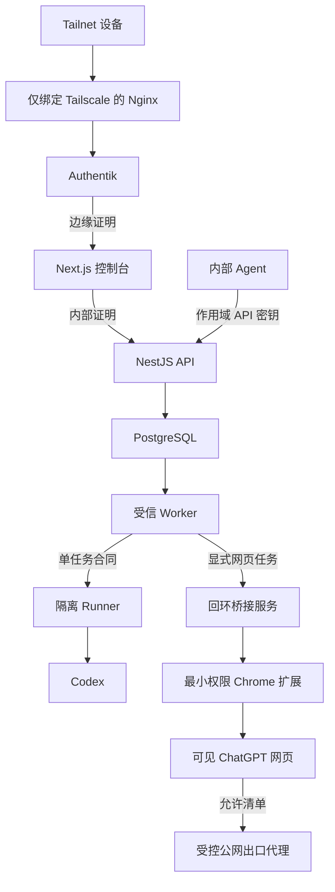

# 1 威胁模型

## 1.1 保护对象

- Codex 登录材料和刷新能力
- Router API 密钥与 Authentik 身份
- 任务正文、事件、内部路径和个人信息
- 配额、用量、审批、审计与备份
- VPS、PostgreSQL、Worker 和现有共享入口
- ChatGPT 浏览器配置卷、扩展桥接密钥和网页任务归属

## 1.2 信任边界

## 1.3 主要威胁与控制

| 威胁                    | 主要控制                                                                                                                       | 剩余风险                                      |
| ----------------------- | ------------------------------------------------------------------------------------------------------------------------------ | --------------------------------------------- |
| 伪造 Authentik 身份     | Router 专用 Group、认证时间、Nginx→Web 与 Web→API 两份独立证明；严格认证标记                                                   | VPS root 失陷可读取证明密钥                   |
| API 密钥泄露            | 只显示一次、HMAC 摘要、调用者隔离、PostgreSQL 原子限速、默认 30 天、确认吊销                                                   | 调用方终端仍需安全保存明文                    |
| 任务读取控制面凭据      | Worker 与 Runner 拆分；Runner 环境允许清单；无数据库、正文主密钥、容器套接字；恶意探针                                         | Codex、容器或内核升级后必须重跑探针           |
| Runner 扩大的系统调用面 | seccomp 只对 Runner 放宽；AppArmor 允许用户命名空间；保留 capability 全部丢弃、非 root、只读根文件系统、内部控制网络和任务探针 | AppArmor 不是文件边界；任何探针失败都关闭接单 |
| 任务外传数据            | 首版拒绝全部联网任务并关闭 Web Search；工具事件与最终输出保存前执行秘密扫描                                                    | 未被规则识别的新型秘密仍需人工治理            |
| 数据库泄露              | 每记录数据密钥、带 Job ID、字段与版本 AAD 的 AES-256-GCM、数据库外主密钥                                                       | 在线 API 失陷可能使用解密能力                 |
| 数据保留超期            | 正文、输出和事件 24 小时删除；元数据 90 天删除                                                                                 | 备份和崩溃转储需独立核查                      |
| 委派雪崩                | 深度 1、子任务禁委派、父任务最多 4 个逻辑子任务                                                                                | 多个独立父任务受全局并发限制                  |
| 共享入口变更故障        | 修改前备份、失败恢复、`nginx -t`、现有站点冒烟                                                                                 | 人工跳过验收仍可能影响其他站点                |
| 网页结果串入其他任务    | 单标签单任务绑定、用户消息回显、对话地址绑定、生成结束、两次稳定读取和静默期同时成立后才返回                                   | 页面结构变化可能使通道拒绝任务                |
| 网页任务重复发送        | 发送前稳定任务编号、内容脚本单次发送标记、发送后不自动重试、无法确认时返回 `chatgpt_delivery_uncertain`                        | 管理员手动操作同一标签会破坏归属证明          |
| 浏览器登录状态泄露      | 独立配置卷 `0700`、不进入普通备份、无 Cookie 权限、无远程调试端口、noVNC 经过 Tailnet 与 Authentik                             | VPS root 或浏览器漏洞仍可取得会话             |
| 网页浏览器访问内网      | 浏览器无直接出口，只能经过域名允许清单代理；代理拒绝回环、私网、Tailnet、Docker 网段和云元数据                                 | 允许域名自身被攻陷时仍可能返回恶意内容        |
| 网页验证保护被绕过      | 验证、重新登录或账号警告出现时停止任务并通知管理员；没有指纹伪装、验证码处理或保护规避代码                                     | 服务方仍可因自动化行为限制账号                |

## 1.4 发布前必须完成

- 用专用 VPS Codex 登录完成读取身份文件、路径越界、出网和会话残留探针
- 证明任务读取数据库连接、正文主密钥、进程环境与 `/run/secrets` 全部失败
- 在最终 Nginx 下验证 nonce CSP、Authentik 登录、密钥创建和任务提交
- 完成备份恢复、主密钥保管和删除回执演练
- 完成 30/150 项评测、并发 1→2→4 和 24 小时稳定试验
- 对冻结的 GitHub 发布副本执行全历史、二进制、密钥、隐私、许可证和 SBOM 门禁
- 每个生产网页账号完成无消息就绪检查和一次成功的 `single_probe`，证明单次提交、临时对话和结果归属均正确；`full_10` 仅作为可选强化观察
- 证明网页浏览器不能访问数据库、正文主密钥、Codex 身份、容器套接字、宿主目录、回环、私网、Tailnet 和云元数据
