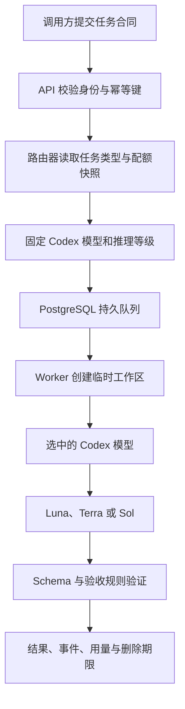

# `RouteLoom` 使用指南

## 1 使用范围

本指南说明 `RouteLoom` 怎样接收任务、怎样选择模型、怎样返回结果，以及本人设备和内部 `Agent` 应该选择哪个调用入口

`Responses` 兼容接口适合已有模型调用程序

`Jobs` 接口适合需要排队和追踪状态的任务

`CLI` 适合终端脚本，`TypeScript` 客户端适合应用集成

`MCP` 适合让 `Codex` 等 `Agent` 把子任务委派给路由器

仓库截图使用合成数据，不会调用真实模型；生产根路径不提供公开展示面

真实调用可以使用本地 Compose 或由 Authentik 保护的 `VPS`

两种方式都需要 `Codex` 登录、`Worker` 启动和 `API Key` 创建

## 2 任务执行流程

<div align="center">



图 2.1 从任务合同到可验证结果的执行流程

</div>

路由器在接单时只固定单个 Codex 模型和单个推理等级

Worker 首次产生输出或工具副作用后会保持原路由

这项限制可以防止同一任务在不同模型之间产生不一致结果

## 3 首次配置

### 3.1 准备受保护入口

生产入口使用 HTTPS 域名示例 `https://router.example.com`

`Nginx` 只绑定 Tailscale 接口；根路径与控制台进入 Authentik，`/api/v1` 与 `/v1` 还要求作用域 API 密钥

`VPS` 需要满足以下条件：

- `PostgreSQL`、`API` 和 `Web` 健康检查通过
- Compose 中只有一个专用 `Codex Worker` 已启动
- `Worker` 专用账户已经完成 `codex login`
- `CODEX_MAX_CONCURRENCY` 首次部署保持 `1`
- Authentik 登录、边缘证明和内部证明均通过伪造头测试

完整部署顺序见[部署指南](deployment.md)

### 3.2 创建首个管理员 `API Key`

`BOOTSTRAP_ADMIN_TOKEN` 只用于第一次创建管理员凭据

根据 [`KeysController`](../apps/api/src/keys/keys.controller.ts) 与 [`packages/security`](../packages/security/src/index.ts) 的实现，`API` 返回的明文 `API Key` 只出现一次，服务端保存 `HMAC-SHA-256` 摘要

```powershell
$RouterUrl = "https://router.example.com" # 使用实际 HTTPS 域名替换示例地址
$BootstrapToken = Read-Host "Bootstrap token" # 从安全渠道读取一次性引导令牌，避免写入命令历史
$BootstrapHeaders = @{ "X-Bootstrap-Token" = ${BootstrapToken} } # 只在首次管理员密钥请求中发送引导令牌
$BootstrapBody = @{ name = "Bootstrap administrator"; scopes = @("admin") } | ConvertTo-Json # 创建具有管理员作用域的首个密钥请求
$CreatedKey = Invoke-RestMethod -Method Post -Uri "$RouterUrl/api/v1/bootstrap/keys" -Headers $BootstrapHeaders -ContentType "application/json" -Body $BootstrapBody # 调用只能成功一次的引导接口
$env:ROUTELOOM_API_KEY = $CreatedKey.key # 把一次显示的密钥保存在当前 PowerShell 进程，关闭终端后自动清除
```

生产环境可由 Authentik 管理员在控制台创建首个 `API Key`；本地模式仍可使用一次性 Token 和 Passkey

本地 Passkey 会话当前持续 12 小时，注册和登录挑战当前持续 5 分钟

这两个数值来自 [`AuthController`](../apps/api/src/auth/auth.controller.ts)

## 4 `Responses` 兼容接口

完整能力边界见 [API capabilities](api-capabilities.md)：兼容接口只覆盖已实现的参数子集，网页流式连接返回终态正文，不等同于逐 token 输出；输出 token 参数当前不是上游硬上限

### 4.1 适用场景

`POST /v1/responses` 适合已有 `OpenAI Responses` 调用结构的程序

首版支持文本、模型别名、推理等级、`JSON Schema`、普通响应、`Server-Sent Events` 流和用量

不支持的字段会返回 `400 unsupported_parameter`

### 4.2 `Luna` 结构化分类案例

以下请求把一个边界清楚的分类任务固定交给 `Luna`，并用 `JSON Schema` 要求结构化结果

```powershell
$RouterUrl = "https://router.example.com" # 使用部署者提供的受保护入口
$Headers = @{ # 为写请求同时准备身份凭据和幂等键
    Authorization = "Bearer $env:ROUTELOOM_API_KEY" # 使用具有 jobs:write 作用域的 API Key
    "Idempotency-Key" = [guid]::NewGuid().ToString() # 同一业务请求重试时复用这个值，避免重复执行
} # 完成请求头定义
$Schema = @{ # 定义最终结果必须满足的 JSON Schema
    type = "object" # 要求模型返回 JSON 对象
    properties = @{ # 声明允许出现的字段
        category = @{ type = "string"; enum = @("notice", "action", "invoice", "spam") } # 限制分类枚举
        confidence = @{ type = "number"; minimum = 0; maximum = 1 } # 把置信度限制在 0 到 1
    } # 完成字段集合定义
    required = @("category", "confidence") # 要求两个字段同时存在
    additionalProperties = $false # 拒绝 Schema 之外的字段
} # 完成 Schema 定义
$Request = @{ # 创建 Responses 兼容请求
    model = "luna" # 固定使用 Luna，便于做可重复的批量实验
    input = "请分类：服务器证书将在 3 天后到期，需要安排续期" # 使用合成任务内容
    reasoning = @{ effort = "low" } # 边界清楚的分类任务使用低推理等级
    text = @{ format = @{ type = "json_schema"; name = "message_classification"; schema = $Schema; strict = $true } } # 启用严格结构化输出
    max_output_tokens = 200 # 限制短分类结果的最大输出量
} | ConvertTo-Json -Depth 12 # 保留嵌套 Schema 的全部层级
$Response = Invoke-RestMethod -Method Post -Uri "$RouterUrl/v1/responses" -Headers $Headers -ContentType "application/json" -Body $Request # 等待任务进入终态并返回结果
$Response | Select-Object status, model, output, usage # 查看任务状态、实际模型、输出和独立用量账本
```

成功响应包含 `status`、实际 `model`、`output`、`usage` 和内部 `job_id`

`Schema` 或验收规则失败时，调用进入 `failed`，错误码为 `validation_failed`

系统不会自动从 `Luna` 连跳到 `Terra` 或 `Sol`

### 4.3 流式响应

把请求中的 `stream` 设为 `$true` 后，服务端通过 `Server-Sent Events` 发送 `response.created`、文本增量、工具事件和最终事件

调用方需要忽略无法识别的新事件，并在收到 `[DONE]` 后关闭读取循环

`TypeScript` 流式解析实现见 [`RouteLoomClient.streamResponse`](../packages/client/src/index.ts)

### 4.4 多轮会话

默认调用是一次性的：执行结束后 Runner 立即删除会话文件；需要连续多轮对话时，第一轮在 `aialra` 命名空间声明 `session_mode: "persistent"`，成功响应的 `metadata.session_key` 就是可续聊的线程标识；后续请求携带 `aialra.session_key` 即可继续同一线程，模型和推理档位自动粘住第一轮

原生 `Jobs` 接口对应字段是任务合同里的 `sessionMode` 和 `sessionKey`

线程默认 `24` 小时到期，可用环境变量 `SESSION_THREAD_TTL_MS` 调整；会话文件只保存在 Runner 的 Codex 目录，由 Runner 按 `CODEX_SESSION_TTL_MS` 定期清理，不进入数据库、日志或备份；`GET /api/v1/threads` 列出当前调用方可见的线程

### 4.5 `Chat Completions` 兼容接口

`POST /v1/chat/completions` 接受文档所列的 OpenAI Chat Completions 文本兼容子集，支持该子集的客户端只需更换 `base_url` 和密钥即可调用

- 支持 `messages`、`stream`、`stream_options.include_usage`、`max_tokens`、`max_completion_tokens`、`response_format`（`text`、`json_object`、`json_schema`）、`reasoning_effort`、`metadata` 和 `aialra` 扩展
- 多轮对话由客户端携带完整消息历史；也可以在 `aialra.session_key` 中传入线程标识，此时只发送最新一条用户消息，上下文由 Codex 线程保留
- `Idempotency-Key` 在此接口可选；提供时按原生接口同一规则去重
- 未支持字段返回 `400 unsupported_parameter`；等待超时但调用仍在执行时返回 `504 gateway_timeout` 并附带任务编号，可转到 `Jobs` 接口查询结果

### 4.6 ChatGPT 网页通道

网页通道只在调用方显式设置 `execution_channel: "chatgpt_web"` 时使用；普通 Codex 请求不会暗中切换通道

`chatgpt-web.auto` 只表示网页自动模型入口，不表示任何思考深度。Codex 的 `reasoning_effort` 和 Responses 的 `reasoning.effort` 不能控制 ChatGPT 网页；网页请求显式传这两个字段会在创建任务前返回 `400 unsupported_parameter`，而不是悄悄使用网页默认档位。网页档位只能通过 `aialra.thinking_depth` 指定，原生 Jobs 使用 `task.chatgptWeb.thinkingDepth`

Agent 应先用具有 `jobs:read` 权限的密钥读取 `/api/v1/models`，从 `chatgpt-web.auto` 的 `webThinkingDepths` 中选择当前真实存在的标签。列表是可用账号的合并结果，Worker 会在提交前再次核对被分配账号；某档位消失时返回 `chatgpt_thinking_depth_unavailable`，不会发送消息或自动降档。未指定档位时使用页面默认值，不代表 Pro 最高档，也不能仅凭 Pro 订阅标签推断具体模型

管理员需要先通过受 Tailnet 和 Authentik 保护的 noVNC 页面手动登录 ChatGPT，再从页面动态发现并启用可见模型

```powershell
$WebModels = (Invoke-RestMethod -Method Get -Uri "$RouterUrl/api/v1/models" -Headers @{ Authorization = $Headers.Authorization }).data # 读取当前网页档位，不发送消息
$WebModel = $WebModels | Where-Object { $_.id -eq "chatgpt-web.auto" } | Select-Object -First 1 # 选择网页自动模型入口
$DesiredDepth = "<从 webThinkingDepths 复制的精确标签>" # 由调用方明确决定，不猜测或硬编码套餐档位
if ($DesiredDepth -notin $WebModel.webThinkingDepths) { throw "当前网页账号不提供所选思考深度" } # 提交前本地检查
$WebRequest = @{ # 创建明确选择网页通道的 Responses 请求
    model = "chatgpt-web.auto" # 使用管理员启用的网页自动模型入口
    input = "调查一个合成主题，并列出公网来源" # 避免在实验任务中放入凭据和个人信息
    aialra = @{ # 使用 AIALRA 命名空间，避免伪装成 OpenAI 官方字段
        execution_channel = "chatgpt_web" # 明确选择网页通道
        chatgpt_mode = "search" # 选择普通对话、搜索或深度研究之一
        thinking_depth = $DesiredDepth # 传当前页面发现的精确标签
        require_sources = $true # 要求提取最终回答中的公网来源
    } # 完成实验参数
} | ConvertTo-Json -Depth 8 # 保留嵌套字段
Invoke-RestMethod -Method Post -Uri "$RouterUrl/v1/responses" -Headers $Headers -ContentType "application/json" -Body $WebRequest # 等待最终完整正文
```

网页流式请求只发送状态和 1 次最终完整正文，不伪造逐 Token 增量

普通聊天和搜索始终使用新的非个性化 Temporary Chat。Deep Research 改用每次新建的普通持久会话，因为当前 Temporary Chat 页面没有稳定入口；调用方必须显式传入 `deep_research_persistence_acknowledged = $true`，并承担该内容进入 ChatGPT 历史记录、可能使用账号记忆或个性化的风险

搜索和 Deep Research 属于长任务，调用方应优先使用原生 `Jobs` 接口，保存创建请求返回的任务编号并轮询原任务

`deadlineMs` 从 API 接受任务时开始计算；同一个绝对截止时间会传过 Worker、Runner、Bridge 和页面，排队、等待账号和组件转发不会重新获得时间；数据库队列会额外保留 5 分钟结果写入与页面重置余量，网页账号租约会在任务运行期间持续续期

如果客户端连接断开，不要创建第二条请求；使用原幂等键重取原任务，或直接通过任务编号读取状态、事件和最终结果

以下期限适合作为起点：普通聊天 `600000` 毫秒，搜索 `3600000` 毫秒，Deep Research `3600000` 毫秒；期限只控制本系统最多等待多久，不能保证上游一定在期限内生成结果

```powershell
$DeepResearchRequest = @{
    model = "chatgpt-web.auto"
    input = "调查一个不含隐私信息的合成主题，并列出公开来源"
    aialra = @{
        execution_channel = "chatgpt_web"
        chatgpt_mode = "deep_research"
        conversation_mode = "persistent_per_request"
        temporary_chat = $false
        deep_research_persistence_acknowledged = $true
        require_sources = $true
    }
} | ConvertTo-Json -Depth 8
Invoke-RestMethod -Method Post -Uri "$RouterUrl/v1/responses" -Headers $Headers -ContentType "application/json" -Body $DeepResearchRequest
```

Deep Research 响应包含 `X-AIALRA-Data-Retention: persistent_chat_history`；普通聊天和搜索返回 `temporary_or_provider_managed`。网页通道不支持 `session_key` 续接，任何模式都只允许提交 1 次

ChatGPT 网页没有提供可靠的 Token、Codex Credits、额度变化或 API 等效价格；接口返回 `measurementStatus: "unavailable"`，控制台显示“网页未提供可靠数据”

Browser 刚启动时，思考深度目录可能仍在读取网页控件。`/api/v1/models` 会等待本次读取完成后再返回，调用方应从 `webThinkingDepths` 选择精确标签，不要缓存猜测值。显式档位尚未验证时，任务会在发送前返回 `chatgpt_thinking_depth_unavailable`，不会降级到其他档位，也不会发送消息

调用结束后，通过 `GET /api/v1/jobs/{id}` 查看 `webExecution`：`requestedThinkingDepth` 是请求值，`resolvedThinkingDepth` 是页面在发送前确认的标签，`thinkingDepthVerified` 表示是否有可核对的页面证据，`accountId` 是实际使用的脱敏账号槽位。`route.effort` 是保留的 Codex 路由字段，不是网页实际档位；`webExecution` 无法证明网页服务背后的隐藏模型身份。普通聊天和搜索的流式接口只发送状态与最终正文，不承诺逐 Token 增量

启用、真实网页探针、安全边界和完整错误说明见[ChatGPT 网页通道](chatgpt-web-experiment.md)

## 5 原生 `Jobs` 接口

### 5.1 适用场景

`Jobs` 接口适合长任务、批量任务、审批任务和需要断线恢复的调用方

任务创建后立即获得 `job.id`，调用方可以查询状态、订阅事件或取消任务

### 5.2 `Terra` 代码审查案例

```powershell
$RouterUrl = "https://router.example.com" # 使用受保护 API 入口
$Headers = @{ # 创建带最小作用域 API Key 的请求头
    Authorization = "Bearer $env:ROUTELOOM_API_KEY" # API Key 至少需要 jobs:write 和 jobs:read
    "Idempotency-Key" = [guid]::NewGuid().ToString() # 网络重试时复用同一幂等键
} # 完成请求头定义
$JobRequest = @{ # 使用完整任务合同描述审查目标和边界
    task = @{ # 任务合同决定路由、安全权限和验收方式
        objective = "审查提供的合成 TypeScript 片段并返回 3 项以内的确定问题" # 提供单一明确目标
        taskKind = "review" # review 默认路由到 Terra
        requiredContext = @("输入内容不包含真实仓库路径或凭据") # 只传递执行所需上下文
        constraints = @("只报告可以由代码证明的问题", "不要修改文件") # 约束输出范围和副作用
        expectedOutput = "按严重度返回问题、证据和修复建议" # 说明合格结果的结构
        dataClassification = "internal" # 标记任务数据等级
        permissions = @{ preset = "restricted" } # 使用只读且无网络的普通 API 密钥默认权限
        deadlineMs = 120000 # 使用契约默认值对应的 120 秒期限
        model = "auto" # 让确定性路由器根据任务类型选择模型
        effort = "medium" # 日常代码审查使用中等推理等级
    } # 完成任务合同定义
    metadata = @{ source = "usage-guide" } # 添加不含敏感信息的调用来源标签
} | ConvertTo-Json -Depth 10 # 保留任务合同的嵌套结构
$Job = Invoke-RestMethod -Method Post -Uri "$RouterUrl/api/v1/jobs" -Headers $Headers -ContentType "application/json" -Body $JobRequest # 创建持久任务
$JobId = $Job.id # 保存任务标识以便查询、订阅和取消
$Status = Invoke-RestMethod -Method Get -Uri "$RouterUrl/api/v1/jobs/$JobId" -Headers @{ Authorization = $Headers.Authorization } # 查询当前状态和路由决定
$Events = Invoke-RestMethod -Method Get -Uri "$RouterUrl/api/v1/jobs/$JobId/events?after=-1" -Headers @{ Authorization = $Headers.Authorization } # 读取已经持久化的有序事件
$Status | Select-Object id, status, route, validation, usage # 查看路由、验证和用量结果
$Events.data | Select-Object sequence, type, data # 查看状态、工具、审批、验证、用量和错误事件
```

任务状态按照 `accepted → queued → running → validating` 推进

终态为 `succeeded`、`failed`、`cancelled` 或 `expired`

`confirm` 权限会先进入 `awaiting_approval`，管理员授权后才进入 `queued`

### 5.3 执行权限

调用通道与执行权限是两个独立限制。创建 API 密钥时，`executionChannels` 可设为 `codex`、`chatgpt_web` 或同时包含两者；API 会拒绝密钥未获授权的通道。`chatgpt_web` 还必须同时具有 `chatgpt:web` 作用域，旧密钥未设置该字段时会按原作用域保持原有能力

仅 ChatGPT 密钥不接受 Codex 工作区权限配置；管理员密钥固定允许两个通道。接口会拒绝互相矛盾的组合，而不是静默忽略字段

三档权限都只作用于本次调用的一次性隔离工作区：

| 预设         | 文件 | 公开互联网 | 启动前确认 |
| ------------ | ---- | ---------- | ---------- |
| `restricted` | 只读 | 禁止       | 不需要     |
| `confirm`    | 可写 | 允许       | 需要       |
| `full`       | 可写 | 允许       | 不需要     |

网页管理员和可信 Agent 密钥省略权限时使用 `full`，普通 API 密钥省略权限时使用 `restricted`

`full` 不会启用 Codex 的 `danger-full-access`，也不允许读取宿主机、Codex 身份、数据库秘密或其他调用工作区

Responses 接口使用命名空间扩展：

```json
{
  "model": "gpt-5.6-luna",
  "input": "搜索并总结公开资料",
  "aialra": {
    "permission_preset": "full"
  }
}
```

### 5.4 批量任务

`POST /api/v1/batches` 每次接受 1 到 100 个任务，这个范围来自 [`BatchesController`](../apps/api/src/jobs/jobs.controller.ts)

系统把批次幂等键扩展为每项任务的稳定键，因此重试同一批次不会重复执行已经接收的项目

## 6 `CLI` 调用

`CLI` 适合 `PowerShell`、计划任务和本地流水线

仓库构建完成后，可以直接运行编译产物

```powershell
$env:ROUTELOOM_URL = "https://router.example.com" # 指向受保护 HTTPS 入口
$env:ROUTELOOM_API_KEY = "<在安全终端中设置的作用域密钥>" # 使用当前进程环境变量提供密钥，禁止提交到仓库
node apps/cli/dist/main.js call --task "把合成日志分为正常、警告、错误" --kind bounded --model luna --effort low --permission restricted # 创建一个受限权限的 Luna 分类任务
node apps/cli/dist/main.js research --task "调查一个合成主题" --mode search --model chatgpt-web.auto # 创建显式网页搜索任务并返回任务编号
node apps/cli/dist/main.js jobs --limit 20 # 查询最近 20 个任务
node apps/cli/dist/main.js quota # 读取最新 Codex 配额窗口快照
node apps/cli/dist/main.js cancel --id "<任务 UUID>" # 取消仍在排队或运行的任务
```

批量输入使用 `JSON Lines`，每行是单个 `CreateJobRequest`

严格 `JSON` 无法合法加入注释，字段定义以 [`openapi/openapi.yaml`](../openapi/openapi.yaml) 为准

## 7 `TypeScript` 客户端

`TypeScript` 客户端封装身份头、幂等键、错误结构、`Jobs`、`Responses`、事件与配额接口

客户端类型从 `OpenAPI` 生成，接口发生不兼容变化时，持续集成会检测生成文件漂移

```typescript
// 导入仓库提供的类型化客户端
import { RouteLoomClient } from "@aialra/routeloom-client"; // 导入仓库提供的类型化客户端

// 创建只连接私有入口的客户端，API Key 由运行环境注入
const client = new RouteLoomClient({
  baseUrl: process.env.ROUTELOOM_URL!, // 使用受保护 HTTPS 地址
  apiKey: process.env.ROUTELOOM_API_KEY!, // 使用最小作用域 API Key
});

// 创建可追踪的 Terra 审查任务，并使用稳定幂等键防止重复执行
const job = await client.createJob(
  {
    task: {
      objective: "审查合成配置并列出确定风险", // 描述单一审查目标
      taskKind: "review", // 让自动路由选择 Terra
      model: "auto", // 使用策略版本记录路由决定
      effort: "medium", // 为日常审查分配中等推理等级
    },
    metadata: { source: "typescript-example" }, // 使用合成来源标签
  },
  crypto.randomUUID(), // 为本次业务请求生成幂等键
);

// 输出任务标识和初始状态，供后续查询与事件订阅使用
console.log(job.id, job.status); // 保存任务标识并观察初始状态
```

## 8 `Codex MCP` 委派

模型上下文协议（Model Context Protocol，MCP）让 `Codex` 把路由器当作工具使用

`Codex` 桌面应用、`CLI` 和 `IDE` 扩展会共享同一台 `Codex` 主机上的 `MCP` 配置 [1]

- 第一步，构建仓库并在当前终端设置私有入口与 `API Key`

```powershell
pnpm build # 生成 MCP 服务需要的 apps/mcp/dist/main.js
$env:ROUTELOOM_URL = "https://router.example.com" # 设置受保护 HTTPS 入口
$env:ROUTELOOM_API_KEY = "<在安全终端中设置的作用域密钥>" # 设置具有 jobs 和 quota 作用域的密钥
```

- 第二步，在受信任项目的 `.codex/config.toml` 中加入 `STDIO MCP` 配置

`env_vars` 只转发变量名对应的当前环境值，配置文件不会保存密钥 [1]

```toml
[mcp_servers.routeloom] # 注册 RouteLoom 本地 STDIO MCP 服务
command = "node" # 使用 Node.js 启动已构建的 MCP 服务
args = ["apps/mcp/dist/main.js"] # 从仓库根目录加载 MCP 入口
env_vars = ["ROUTELOOM_URL", "ROUTELOOM_API_KEY"] # 从 Codex 主机环境转发私有地址和密钥
required = true # MCP 初始化失败时阻止 Agent 在缺少治理工具的情况下继续
startup_timeout_sec = 10 # 使用官方默认启动等待时间
tool_timeout_sec = 150 # 由默认任务期限 120 秒加 30 秒传输余量得到
enabled_tools = ["delegate_codex", "delegate_chatgpt", "preview_route", "job_status", "cancel_job", "quota_snapshot"] # 启用 Codex 委派、显式网页委派和 4 个治理工具
```

- 第三步，重启 `Codex` 并使用 `/mcp` 检查 `routeloom`

`Codex` 官方文档确认桌面应用、`CLI` 和 `IDE` 扩展支持 `STDIO MCP` 服务，并共享主机配置 [1]

- 第四步，向 `Sol` 或 `Terra` 提交明确委派请求，例如要求先调用 `preview_route`，再通过 `delegate_codex` 把边界清楚的分类子任务交给 `Luna`

`MCP` 服务把委派深度固定为 1，并写入 `child_can_delegate=false`

这项约束来自 [`apps/mcp`](../apps/mcp)

子任务无法继续委派，因此不会形成递归调用链

## 9 模型选择案例

<div align="center">

表 9.1 任务特征、建议通道与验证方法

| 任务特征                       | 建议通道       | 典型案例                     | 最小验证                              |
| ------------------------------ | -------------- | ---------------------------- | ------------------------------------- |
| 边界清楚、结构固定、可自动验证 | `Luna low`     | 分类、抽取、格式转换、短摘要 | `JSON Schema` 或 `contains:` 验收规则 |
| 日常编码、调试、集成和审查     | `Terra medium` | 代码审查、接口接入、失败修复 | 测试、类型检查或人工审查              |
| 高歧义、高风险或分歧裁决       | `Sol high`     | 架构选择、威胁分析、发布裁决 | 决策记录与独立复核                    |
| 明确允许网页实验且需要网页搜索 | `chatgpt_web`  | 搜索、深度研究和来源整理     | 来源完整性与任务归属检查              |

</div>

Codex 通道任务由 Codex 模型执行；只有调用方显式选择、密钥允许且管理员启用后，任务才进入 ChatGPT 网页通道

## 10 常见错误

<div align="center">

表 10.1 首次接入常见错误

| 错误码                             | 原因                                     | 处理方法                                           |
| ---------------------------------- | ---------------------------------------- | -------------------------------------------------- |
| `invalid_api_key`                  | API Key 缺失、过期、吊销或摘要校验失败   | 创建新密钥并检查作用域与到期时间                   |
| `insufficient_scope`               | API Key 缺少接口要求的作用域             | 为调用方签发最小且完整的作用域集合                 |
| `execution_channel_not_allowed`    | API Key 不允许任务选择的执行通道         | 创建允许该通道的新密钥，或改用密钥已允许的通道     |
| `execution_channel_scope_mismatch` | 网页通道与 `chatgpt:web` 作用域配置矛盾  | 同时授予或同时移除网页通道与对应作用域             |
| `idempotency_key_required`         | 写请求没有幂等键                         | 为每个业务请求创建稳定键，并在网络重试时复用       |
| `idempotency_conflict`             | 同一键值对应不同请求摘要                 | 为新业务请求生成新键，保留旧键用于原请求重试       |
| `codex_capacity_constrained`       | 自动 Terra 或 Sol 任务遇到 85% 配额水位  | 显式指定必要模型，或等待当前额度窗口重置           |
| `codex_capacity_reserved`          | 自动 Terra 或 Sol 任务遇到 95% 配额水位  | 仅提交必要的显式任务，或等待额度窗口重置           |
| `codex_auth_expired`               | VPS 上的 Codex 登录令牌已经过期          | 重新完成 Codex 登录后再创建新任务                  |
| `codex_auth_failed`                | Codex 上游拒绝当前授权                   | 检查 VPS 上的 Codex 登录状态                       |
| `codex_quota_exhausted`            | Codex 当前额度已经耗尽                   | 等待额度窗口重置或切换有效的上游授权               |
| `codex_provider_timeout`           | Codex 上游在任务截止时间内没有完成       | 查询原任务状态；提交状态不明时不要创建重复任务     |
| `codex_provider_unavailable`       | Codex 上游或 App Server 暂时不可用       | 保留原任务记录，恢复服务后创建新的幂等任务         |
| `provider_unavailable`             | Worker 没有启用 Codex Adapter            | 检查 Codex 登录和 Adapter 开关                     |
| `invalid_validation_rule`          | 旧版验收规则没有使用允许的前缀           | 改用结构化 `checks`，或使用 `equals:`、`contains:` |
| `validation_failed`                | 模型输出没有通过明确的 Schema 或检查规则 | 查看验证消息，修正输入或规则后重新调用             |
| `permission_ceiling_exceeded`      | 请求权限超过当前 API 密钥上限            | 使用允许该预设的可信 Agent 密钥，或降低权限        |
| `session_expired`                  | 会话线程不存在或已超过保留期限           | 去掉 `sessionKey` 重新开始对话                     |
| `session_access_denied`            | 试图继续其他调用者的会话线程             | 只使用本人密钥创建的线程                           |
| `gateway_timeout`                  | Chat 兼容接口等待超时但调用仍在执行      | 用返回的任务编号查询 `GET /api/v1/jobs/{id}`       |
| `chatgpt_login_required`           | 专用可见浏览器没有有效登录状态           | 管理员打开 noVNC 并手动登录                        |
| `chatgpt_verification_required`    | 网页要求验证码或人工验证                 | 管理员在可见页面处理；系统不会绕过                 |
| `chatgpt_ui_changed`               | 必要页面元素无法识别                     | 关闭网页通道并重新验证页面契约                     |
| `chatgpt_delivery_uncertain`       | 无法证明网页消息是否已经发送             | 保持失败并检查页面；系统不会自动重发               |
| `chatgpt_web_input_too_long`       | 完整网页任务文本超过 4000 字符安全上限   | 缩短目标、上下文或规则；API 不会创建任务或发送消息 |
| `chatgpt_output_incomplete`        | 无法证明最终正文已经稳定                 | 检查可见页面和扩展健康状态                         |
| `chatgpt_sources_missing`          | 回答完成但没有提供可验证的公网来源       | 调整来源要求；账号不会因此被隔离                   |

</div>

## 11 参考资料

[1] OpenAI, “Model Context Protocol,” 访问日期：2026-08-25 [在线] 可访问：[Codex MCP 配置](https://developers.openai.com/codex/mcp)
